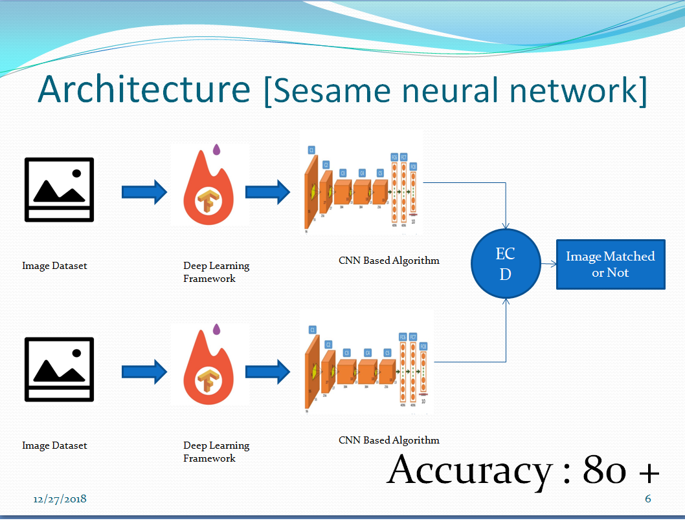
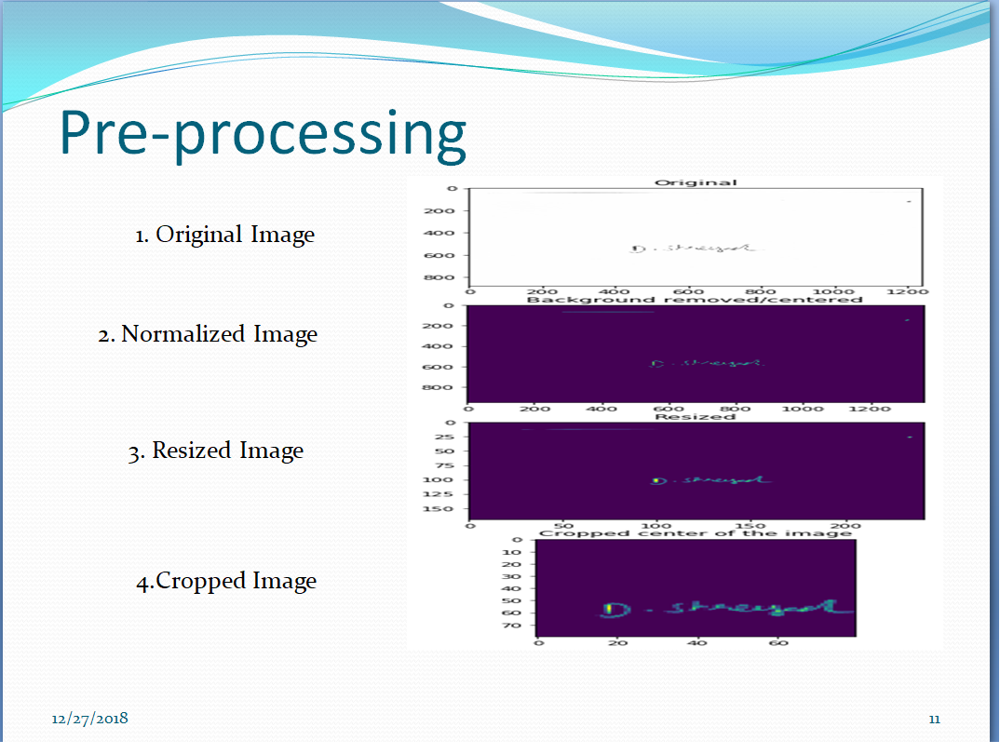
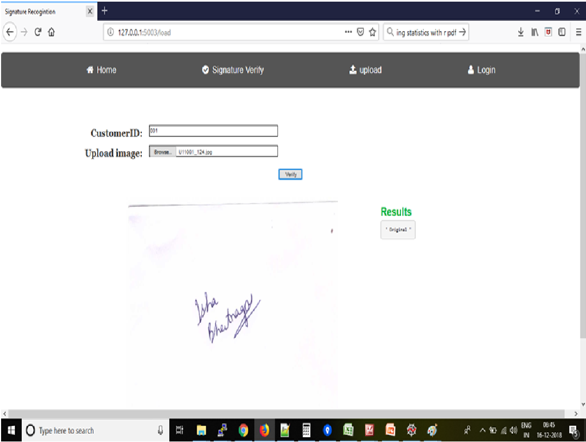
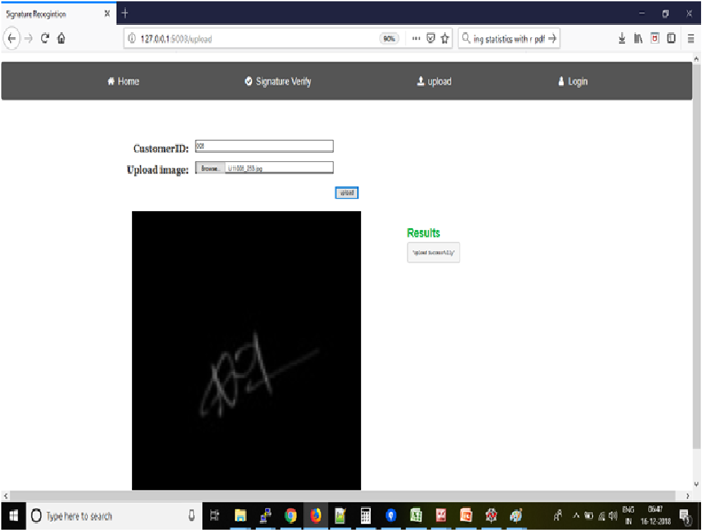

# Signature-comparison-using-Siamese-Neural-Network
AI Computer Vision Based Signature Recognition

This project focuses on "Signature Verification" by [Keras and ObjectTensorFlow Detection API](https://github.com/tensorflow/models/tree/master/research/object_detection). 

The system shall work in 2 steps:

Step 1: Accept & Store Genuine Signature Image: Take actual signature scanned image of the on-boarding customer and store it in a database against a unique Customer ID

Step 2: Accept & Compare Signature Images: Accept inputs of Customer ID, and corresponding signature image. Compare with the signature stored in DB against the given Customer ID, and return a Confidence Match Score between the two signature images

# More Details can be found in PPT

## Dataset used :

CEDAR

HINDI and Bengali Dataset

## Quick Demo

https://youtu.be/HrVEKQ_5GtQ

***THE DEVELOPING IS ON PROGRESS! THE REPO WILL BE UPDATED SOON, !***

--------------

## Architecture

  

-------------------------------------------------------------------------------------------

## Preprocessing

  

-------------------------------------------------------------------------------------------

## Result 1

  
">

-------------------------------------------------------------------------------------------

## Result 2

  
">

-------------------------------------------------------------------------------------------

TensorFlow™ is an open source software library for numerical computation using data flow graphs. Nodes in the graph represent mathematical operations, while the graph edges represent the multidimensional data arrays (tensors) communicated between them.

## Project Demo

## Installation

**1.) Python and pip**

Python is automatically installed on Ubuntu. Take a moment to confirm (by issuing a python -V command) that one of the following Python versions is already installed on your system:

- Python 2.7
- Python 3.3+

The pip or pip3 package manager is usually installed on Ubuntu. Take a moment to confirm (by issuing a *pip -V* or *pip3 -V* command) that pip or pip3 is installed. We strongly recommend version 8.1 or higher of pip or pip3. If Version 8.1 or later is not installed, issue the following command, which will either install or upgrade to the latest pip version:

    $ sudo apt-get install python-pip python-dev   # for Python 2.7
    $ sudo apt-get install python3-pip python3-dev # for Python 3.n
    
**2.) OpenCV**

See required commands to install OpenCV on Ubuntu in [here](https://gist.github.com/dynamicguy/3d1fce8dae65e765f7c4).

**3.) TensorFlow**

Install TensorFlow by invoking one of the following commands:

    $ pip install tensorflow      # Python 2.7; CPU support (no GPU support)
    $ pip3 install tensorflow     # Python 3.n; CPU support (no GPU support)
    $ pip install tensorflow-gpu  # Python 2.7;  GPU support
    $ pip3 install tensorflow-gpu # Python 3.n; GPU support

**4.) TensorFlow Object Detection API**

See required commands to install TensorFlow Object Detection API on Ubuntu in [here](https://github.com/tensorflow/models/blob/master/research/object_detection/g3doc/installation.md).

**5.) Install Flask**

**6.) Install Sqlite**

# Run "run.py"

## License
This system is available under the MIT license. See the LICENSE file for more info.
